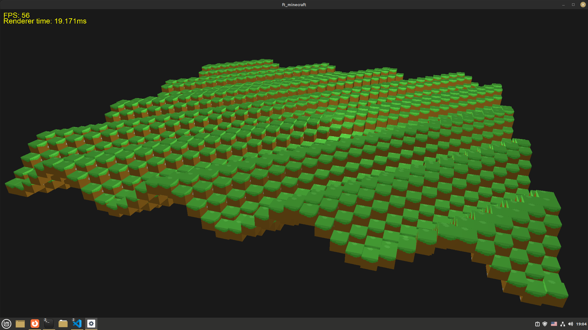
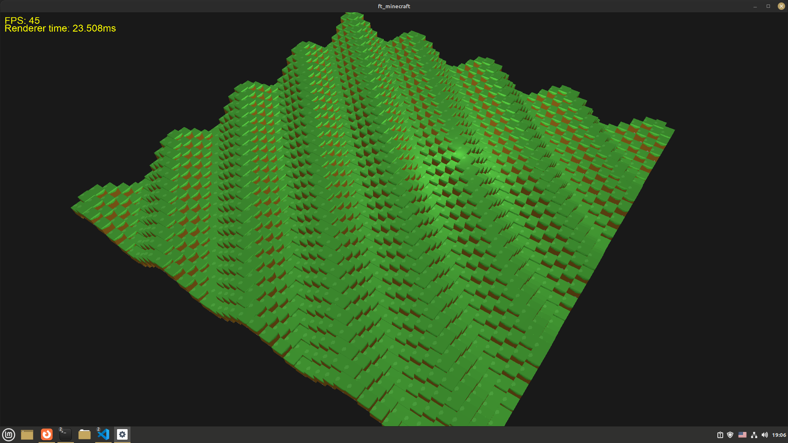

# ft_minecraft
ft_minecraft - это моя попытка воссоздать знаменитую игру майнкрафт, вдохновленная одноименным проектом в школе42. Пока что от майнкрафта есть только кубы.

## Description
Проект сделан на OpenGL с использованием glfw библиотеки.

## Installation
Строго необходимы к установке: libglfw3-dev, libglm-dev
Готовый билд для ubuntu лежит здесь: build/ft_minecraft. На других системах скорее всего не работает.

## Usage
На данный момент доступно простое перемещение по сцене на wasd space и shift. 

## Notes
Все в активной разработке и не очень хорошо протестировано. Так же до документации кода руки пока не дошли так что выглядит он неприятно.

## Screenshots

